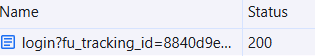
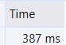

# Câu A1 - HTTP & Browser (Nguồn tham chiếu : 01_introduction_html_universe.md)
1. Khi em gõ https://shopee.vn vào trình duyệt và nhấn Enter, hãy liệt kê đúng thứ tự ít nhất 5 bước xảy ra (từ DNS lookup đến render).
 * Gõ https://shopee.vn -> Enter 
    - DNS Lookup: đổi shopee.vn → địa chỉ IP  
    - TCP handshake: tạo kết nối với server  
    - TLS handshake: mã hóa (HTTPS)  
    - Gửi HTTP request  
    - Server trả về response (HTML)  
    - Trình duyệt tải thêm CSS, JS  
    - Render và hiển thị trang  

2. Trong DevTools của Chrome, tab Network cho thấy thông tin gì? Hãy mở một trang web bất kỳ, chụp screenshot tab Network và đánh dấu (vẽ mũi tên/khoanh tròn) vào:
 * Tab Network cho thấy :
    - Danh sách các request(Name) có đuôi như js,html,css và ảnh
    - Status code (200 = OK, 404 = lỗi không tìm thấy, 500 = lỗi server)
    - Type(Các loại file (html,css,js))
    - Initiator: Request được gọi bởi ai
    - Size(dung lượng file tải về )
    - Time(Thời gian load request)
 * Hình chụp
    - Status Code của request đầu tiên 
    - Tổng thời gian load trang 
    - Một request trả về file CSS 

# Câu A2 (5đ) — Semantic HTML (Nguồn tham chiếu : 04_visible_part_html.md)

```html
<div class="header">
    <div class="logo">ShopTLU</div>
    <div class="menu">
        <div><a href="/">Trang chủ</a></div>
        <div><a href="/products">Sản phẩm</a></div>
    </div>
</div>
<div class="main">
    <div class="product">
        <div class="title">iPhone 16 Pro</div>
        <div class="price">25.990.000đ</div>
        <div class="image"></div>
    </div>
</div>
<div class="footer">© 2026 ShopTLU</div>
```

 * Mẫu trang web như trên bị  Google đánh giá SEO thấp là vì sử dụng quá nhiều thẻ `<div>`  không có ý nghĩa ngữ nghĩa.Cụ thể:
    - Không dùng thẻ `<header>`, `<nav>`, `<main>`, `<footer>` → Google khó hiểu cấu trúc trang  
    - Menu không dùng `<nav>` → không rõ đây là thanh điều hướng  
    - Tiêu đề sản phẩm không dùng thẻ heading (`<h1>`, `<h2>`)  
    - Ảnh không có thuộc tính `alt` → không tốt cho SEO  
    - Thông tin sản phẩm không được đánh dấu rõ ràng (thiếu semantic)

 * Code đã sửa
 
 ```html
<header>
    <h1>ShopTLU</h1>
    <nav>
        <a href="/">Trang chủ</a>
        <a href="/products">Sản phẩm</a>
    </nav>
</header>

<main>
    <article class="product">
        <h2>iPhone 16 Pro</h2>
        <p class="price">25.990.000đ</p>
        
    </article>
</main>

<footer>
    <p>© 2026 ShopTLU</p>
</footer>
```
# Câu A3 (5đ) — Block vs Inline

```html
<div>Hộp 1</div>
<span>Text A</span>
<span>Text B</span>
<div>Hộp 2</div>
<span>Text C</span>
<strong>Text D</strong>
<div>Hộp 3</div>
```
 * Mô tả theo text art
 Hộp 1
 Text A Text B
 Hộp 2
 Text C Text D 
 Hộp 3

  * Giải thích:
    - `<div>` : là Block element,chiếm toàn bộ dòng và luôn xuống dòng riêng
    - `<span>` và `<strong>` : là Inline element,hiển thị cùng dòng , nằm cạnh nhau (`<strong>` với mục đích để nhấn mạnh)

# Câu A4 (5đ) — Table (Nguồn tham chiếu : 05_tables_hyperlinks.md)

 * Sự khác nhau giữa `<thead>`,`<tbody>`, `<tfoot>` là :
    - `<thead>`: chứa phần tiêu đề của bảng (header)  
    - `<tbody>`: chứa nội dung , dữ liệu chính của bảng  
    - `<tfoot>`: chứa phần chân bảng (tổng kết, ghi chú) 
 * Ta không nên dùng table để tạo layout cho trang web là vì:
    - `<table>` dùng cho dữ liệu dạng bảng, không phải để chia bố cục  
    - Lồng nhiều table làm code dài và khó sửa  
    - Google khó hiểu cấu trúc trang  

# Câu B3
 * Lỗi 1: DOCTYPE sai
    - Dòng 1 — `<!DOCTYPE>` thiếu chuẩn HTML5
    - Sửa: `<!DOCTYPE html>`
 * Lỗi 2: meta charset sai
    - Dòng 4 — utf8 sai chuẩn
    -  Sửa: UTF-8
 * Lỗi 3: thiếu đóng thẻ title
    - Dòng 4–5 — `<title>` chưa đóng
    - Sửa: thêm `</title>`
 * Lỗi 4: h1 sai cú pháp
    - Dòng 8 — `<h1>` không đóng đúng
    - Sửa: `<h1>...</h1>`
 * Lỗi 5: link sai cú pháp
    - Dòng 12 — `<a href="home">` thiếu # + thiếu đóng thẻ
    - Sửa: `<a href="#home">...</a>`
* Lỗi 6: ảnh thiếu alt + sai chuẩn
    - Dòng 19 — thiếu alt và quotes
    - Sửa: src="iphone.jpg" alt="iPhone"
 * Lỗi 7: thẻ b sai đóng
    - Dòng 21 — `<b>` và `</b>` sai vị trí
    - Sửa: `<b>25.990.000đ</b>`
 * Lỗi 8: thiếu đóng thẻ p
    - Dòng 35 — `<p>`Copyright 2026 chưa đóng
    - Sửa: `</p>`
 * Lỗi 9: dùng 2 thẻ main (semantic sai)
    - Dòng 38 — chỉ được 1 `<main>`
    - Sửa: đổi main thứ 2 thành `<aside>`
 * Lỗi 10: thiếu lang trong html
    - Dòng 2 — `<html>` thiếu lang
    - Sửa: `<html lang="vi">`

# Câu B4
Chọn Tiki.vn
1. 3 thẻ semantic HTML5 mà trang đó sử dụng là:thẻ `<header>` ,`<main>`,`<footer>` đều nằm trong thẻ `<div class="Home-page">` 
2. Mở tab Elements, tìm 1 <table> trên trang. Chụp screenshot và trả lời:
- Table đó hiển thị nội dung ảnh điện thoại,giá tiền,thông số chi tiết ,so sánh giữa các diện thoại 
- Có sử dụng `<thead>`,`<tbody>`
- link ảnh : 


 


 


